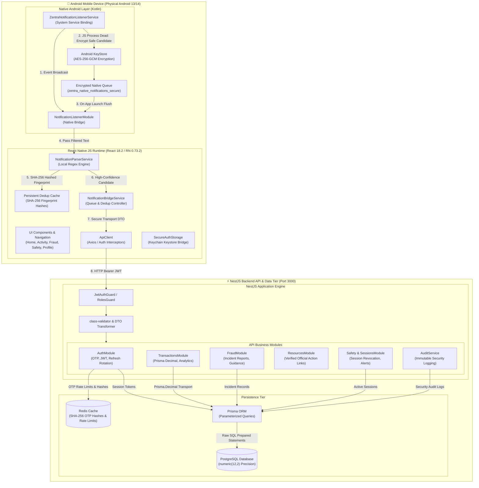
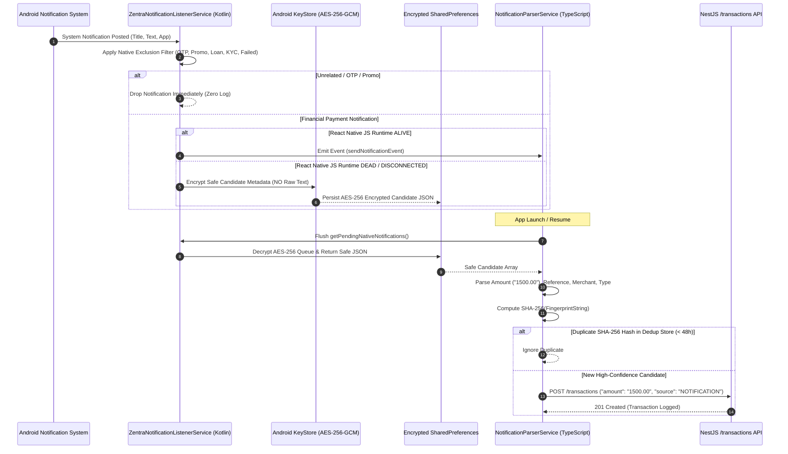
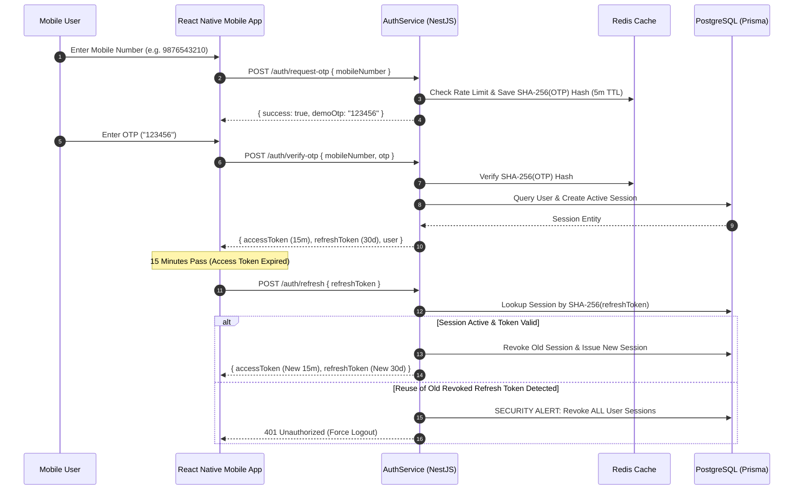

# Zentra — System Architecture & Component Diagram

This document contains the verified system architecture, component relationships, data flow pipelines, and security boundaries of the Zentra application.

---

## 1. High-Level System Architecture Diagram

---

## 2. On-Device Notification Ingestion & Privacy Architecture

---

## 3. End-to-End Authentication & Refresh Token Rotation Flow

---

## 4. Key Security & Boundary Specifications

| Security Boundary | Verified Technical Control |
|---|---|
| **SMS Permissions** | **STRICTLY ABSENT**. Zero `READ_SMS` or `RECEIVE_SMS` manifest permissions. |
| **Notification Privacy** | 100% On-Device local parsing. Zero raw title, text, or payload transmitted to API. |
| **Native Queue Security** | AES-256-GCM encryption using an Android Keystore-managed key (`NativeKeystoreHelper`). |
| **Deduplication Privacy** | SHA-256 hashed fingerprints stored on-device. Zero plaintext amounts/references stored in dedup cache. |
| **Financial Decimal Precision** | Exact string transport (`"1500.75"`), `Prisma.Decimal`, PostgreSQL `numeric(12,2)` column. |
| **Token Storage** | Android Keystore hardware-backed storage via `react-native-keychain`. Zero tokens in `AsyncStorage`. |
| **User Data Isolation** | NestJS Prisma `where: { userId }` filters on all endpoints. Cross-account access returns `404 Not Found`. |
| **Official Emergency Links** | Verified links (`1930`, `cybercrime.gov.in`, `RBI CMS`). Strict `https://` & `tel:` scheme validation. |
