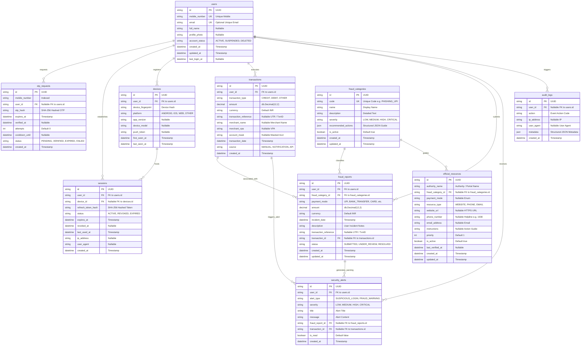
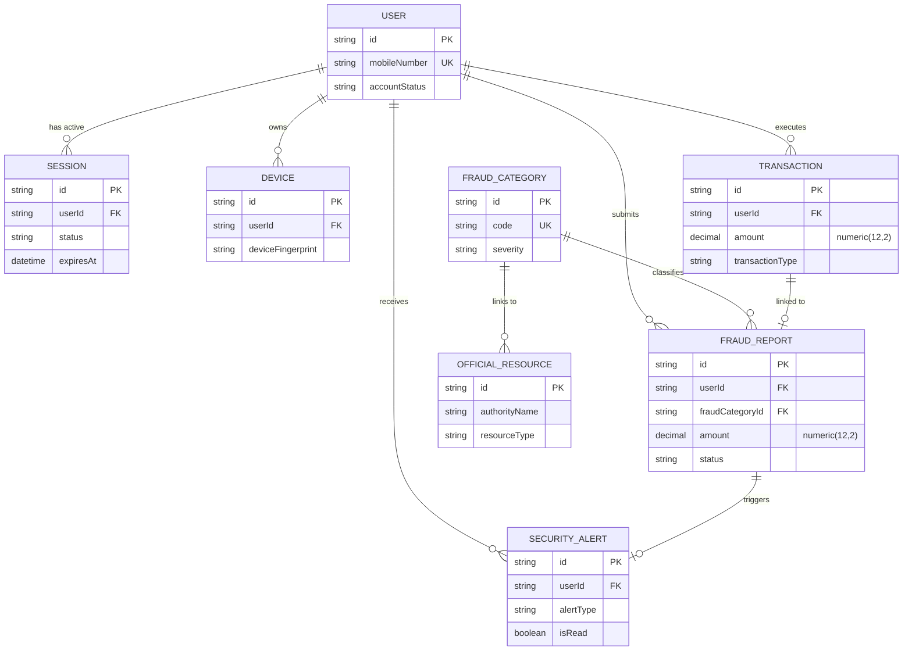

# Zentra — Final Database Entity Relationship Diagram (ERD) & Specification

This document provides the authoritative Entity-Relationship Diagram (ERD), schema topology, relationship cardinality matrix, and security specifications for the Zentra payment security system.

---

## 1. Executive Summary & Domain Scope

The Zentra relational database schema is managed via **Prisma ORM** targeting **PostgreSQL**. The schema consists of **10 Domain Entities** and **11 Type Enums**, engineered for privacy-first transaction monitoring, session tracking, deterministic fraud reporting, and immutable security audit trails.

---

## 2. Version A — Full Technical ERD

---

## 3. Version B — Presentation ERD (PPT / Viva Optimized)

---

## 4. Database Model Summary Table

| Entity / Table Name | Purpose | Primary Key | Foreign Keys | Relationship Summary |
|---|---|---|---|---|
| **`User`** (`users`) | Stores user identity, contact details, and account status | `id` (UUID) | None | 1:N with Sessions, Devices, Transactions, FraudReports, Alerts, AuditLogs |
| **`OtpRequest`** (`otp_requests`) | Persistent audit log of requested OTP verification attempts | `id` (UUID) | `userId` → `User.id` (Optional) | N:1 with User (Cascade Delete) |
| **`Session`** (`sessions`) | Manages active refresh tokens, revocation status, and IP addresses | `id` (UUID) | `userId` → `User.id`, `deviceId` → `Device.id` | N:1 with User (Cascade), N:1 with Device (SetNull) |
| **`Device`** (`devices`) | Tracks unique user hardware devices and push tokens | `id` (UUID) | `userId` → `User.id` | N:1 with User, 1:N with Sessions |
| **`FraudCategory`** (`fraud_categories`) | System catalog of fraud types (e.g. UPI Phishing, QR Scam) | `id` (UUID) | None | 1:N with FraudReports, 1:N with OfficialResources |
| **`OfficialResource`** (`official_resources`) | Official emergency helplines (`1930`) & reporting portals | `id` (UUID) | `fraudCategoryId` → `FraudCategory.id` | N:1 with FraudCategory (SetNull) |
| **`Transaction`** (`transactions`) | Stores user financial transaction activity | `id` (UUID) | `userId` → `User.id` | N:1 with User, 1:N with FraudReports, 1:N with SecurityAlerts |
| **`FraudReport`** (`fraud_reports`) | Records user-submitted payment fraud incident reports | `id` (UUID) | `userId` → `User.id`, `fraudCategoryId` → `FraudCategory.id`, `transactionId` → `Transaction.id` | N:1 with User (Restrict), N:1 with FraudCategory, N:1 with Transaction (SetNull) |
| **`SecurityAlert`** (`security_alerts`) | Notifications regarding unusual activity or fraud warnings | `id` (UUID) | `userId` → `User.id`, `fraudReportId` → `FraudReport.id`, `transactionId` → `Transaction.id` | N:1 with User, N:1 with FraudReport, N:1 with Transaction |
| **`AuditLog`** (`audit_logs`) | Immutable security log of critical system operations | `id` (UUID) | `userId` → `User.id` (Optional) | N:1 with User (SetNull) |

---

## 5. High-Resolution Exported Vector Assets

- **Full Technical ERD SVG**: [`docs/diagrams/zentra_database_erd_full.svg`](file:///c:/Users/kanha/Downloads/Zentra/docs/diagrams/zentra_database_erd_full.svg)
- **Presentation ERD SVG**: [`docs/diagrams/zentra_database_erd_presentation.svg`](file:///c:/Users/kanha/Downloads/Zentra/docs/diagrams/zentra_database_erd_presentation.svg)
