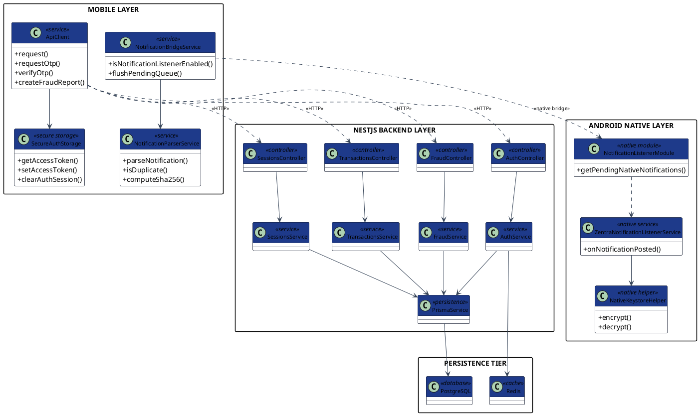

# Zentra — Official Software UML Class Diagram Specification

This document provides the authoritative academic UML Class Diagrams, Layer Specifications, Class Summary Tables, and Source Code Traceability for the Zentra payment security application.

---

## 1. High-Resolution Visual Diagram Assets

- **Full Technical Class Diagram SVG**: [`docs/uml/zentra_class_full.svg`](file:///c:/Users/kanha/Downloads/Zentra/docs/uml/zentra_class_full.svg)
- **Full Technical Class Diagram PNG**: [`docs/uml/zentra_class_full.png`](file:///c:/Users/kanha/Downloads/Zentra/docs/uml/zentra_class_full.png)
- **Presentation Class Diagram SVG**: [`docs/uml/zentra_class_presentation.svg`](file:///c:/Users/kanha/Downloads/Zentra/docs/uml/zentra_class_presentation.svg)
- **Presentation Class Diagram PNG**: [`docs/uml/zentra_class_presentation.png`](file:///c:/Users/kanha/Downloads/Zentra/docs/uml/zentra_class_presentation.png)

---

## 2. Version A — Full Technical UML Class Diagram (PlantUML Source)

```plantuml
@startuml Zentra_Full_Class_Diagram
skinparam backgroundColor white
skinparam packageStyle rectangle
skinparam shadowing false
skinparam classAttributeIconSize 0

skinparam class {
    BackgroundColor #FFFFFF
    BorderColor #0F172A
    HeaderBackgroundColor #1E3A8A
    HeaderFontColor #FFFFFF
    FontName Arial
    FontSize 11
}

skinparam package {
    BackgroundColor #F8FAFC
    BorderColor #334155
    FontName Arial
    FontSize 13
    FontStyle bold
}

skinparam arrow {
    Color #334155
    FontName Arial
    FontSize 10
}

package "REACT NATIVE MOBILE LAYER" {
    package "MOBILE UI COMPONENTS" {
        class LoginScreen <<screen>> {
            +handleRequestOtp()
            +handleVerifyOtp()
        }
        class HomeScreen <<screen>> {
            +loadDashboard()
        }
        class ActivityScreen <<screen>> {
            +loadTransactions()
        }
        class IncidentGuidanceScreen <<screen>> {
            +loadGuidance()
            +handleProceedExternal()
        }
        class SafetyScreen <<screen>> {
            +checkNotificationPermission()
            +toggleNotificationListener()
        }
        class SessionsScreen <<screen>> {
            +loadSessions()
            +handleRevokeSession()
        }
    }

    package "MOBILE SERVICES & API CLIENT" {
        class ApiClient <<service>> {
            -isRefreshing: boolean
            -refreshPromise: Promise
            +request(endpoint, method, body, options): Promise
            -acquireTokenRefresh(): Promise
            -executeTokenRefresh(): Promise
            +requestOtp(mobileNumber): Promise
            +verifyOtp(mobileNumber, otp): Promise
            +logout(): Promise
            +getProfile(): Promise
            +createFraudReport(dto): Promise
        }

        class SecureAuthStorage <<secure storage>> {
            +getAccessToken(): Promise
            +setAccessToken(token): Promise
            +getRefreshToken(): Promise
            +setRefreshToken(token): Promise
            +clearAuthSession(): Promise
            +getPersistentDedupCache(): Promise
            +setPersistentDedupCache(data): Promise
        }

        class NotificationParserService <<service>> {
            -persistentDedupCache: Map
            +parseNotification(title, body, timestamp, userId): ParsedTransactionCandidate
            +formatAmountDecimal(rawAmountStr): string
            +isDuplicate(fingerprintHash): boolean
            +computeSha256(str): string
        }

        class NotificationBridgeService <<service>> {
            -pendingQueue: CandidateQueue
            +isNotificationListenerEnabled(): Promise
            +openNotificationListenerSettings()
            +getPendingNativeNotifications(): Promise
            +processHighConfidenceCandidate(candidate): Promise
            +flushPendingQueue(): Promise
        }

        interface ParsedTransactionCandidate <<DTO>> {
            +transactionType: string
            +amount: number
            +amountFormatted: string
            +currency: string
            +merchantName: string
            +transactionReference: string
            +accountMask: string
            +confidence: string
            +fingerprint: string
        }
    }
}

package "ANDROID NATIVE LAYER" {
    class ZentraNotificationListenerService <<native service>> {
        +onNotificationPosted(sbn)
        +onListenerConnected()
        -filterExclusionPatterns(title, text): boolean
    }

    class NativeKeystoreHelper <<native helper>> {
        -KEY_ALIAS: string
        -getSecretKey(): SecretKey
        +encrypt(plaintext): string
        +decrypt(ciphertext): string
    }

    class NotificationListenerModule <<native module>> {
        +NAME: string
        +isNotificationListenerEnabled(promise)
        +openNotificationListenerSettings()
        +getPendingNativeNotifications(promise)
    }

    class NotificationListenerPackage <<native package>> {
        +createNativeModules(reactContext)
        +createViewManagers(reactContext)
    }
}

package "NESTJS BACKEND API LAYER" {
    package "CONTROLLERS" {
        class AuthController <<controller>> {
            +requestOtp(dto): POST /auth/request-otp
            +verifyOtp(dto): POST /auth/verify-otp
            +refresh(dto): POST /auth/refresh
            +logout(dto): POST /auth/logout
        }

        class TransactionsController <<controller>> {
            +create(dto): POST /transactions
            +findAll(query): GET /transactions
            +findOne(id): GET /transactions/:id
            +getSummary(): GET /transactions/summary
        }

        class FraudController <<controller>> {
            +getCategories(): GET /fraud/categories
            +createReport(dto): POST /fraud/reports
            +getReports(): GET /fraud/reports
            +getGuidance(id): GET /fraud/reports/:id/guidance
        }

        class SessionsController <<controller>> {
            +getSessions(): GET /sessions
            +revokeSession(id): DELETE /sessions/:id
            +revokeOtherSessions(): DELETE /sessions/others
        }
    }

    package "SERVICES & PERSISTENCE" {
        class AuthService <<service>> {
            +requestOtp(mobileNumber)
            +verifyOtp(mobileNumber, otp)
            +refreshTokens(refreshToken)
            +logout(refreshToken)
        }

        class TransactionsService <<service>> {
            +create(userId, dto)
            +findAll(userId, query)
            +getSummary(userId)
        }

        class FraudService <<service>> {
            +createReport(userId, dto)
            +getReports(userId)
            +getGuidance(userId, reportId)
        }

        class SessionsService <<service>> {
            +getUserSessions(userId)
            +revokeSession(userId, sessionId)
            +revokeOtherSessions(userId, currentSessionId)
        }

        class PrismaService <<persistence>> {
            +user: UserDelegate
            +transaction: TransactionDelegate
            +fraudReport: FraudReportDelegate
            +session: SessionDelegate
            +onModuleInit()
        }

        class AuditService <<audit>> {
            +log(userId, action, metadata)
        }
    }
}

package "EXTERNAL INFRASTRUCTURE" {
    class PostgreSQL <<database>> {
        +tables: users, transactions, fraud_reports, sessions
    }

    class Redis <<cache>> {
        +keys: otp_ratelimit, otp_hash
    }
}

' UI to Services dependencies
LoginScreen --> ApiClient
HomeScreen --> ApiClient
ActivityScreen --> ApiClient
IncidentGuidanceScreen --> ApiClient
SafetyScreen --> NotificationBridgeService
SessionsScreen --> ApiClient

' Mobile Internal Dependencies
ApiClient --> SecureAuthStorage
NotificationBridgeService --> NotificationParserService
NotificationBridgeService --> ApiClient
NotificationParserService ..> ParsedTransactionCandidate

' Mobile to Native Bridge
NotificationBridgeService ..> NotificationListenerModule : <<bridge calls>>
ZentraNotificationListenerService --> NativeKeystoreHelper
NotificationListenerModule ..> ZentraNotificationListenerService : <<queries pending>>
NotificationListenerPackage --> NotificationListenerModule

' Mobile API to NestJS HTTP
ApiClient ..> AuthController : <<HTTP POST>>
ApiClient ..> TransactionsController : <<HTTP GET/POST>>
ApiClient ..> FraudController : <<HTTP GET/POST>>
ApiClient ..> SessionsController : <<HTTP GET/DELETE>>

' NestJS Controller to Service
AuthController --> AuthService
TransactionsController --> TransactionsService
FraudController --> FraudService
SessionsController --> SessionsService

' NestJS Service to Persistence
AuthService --> PrismaService
AuthService --> Redis
TransactionsService --> PrismaService
FraudService --> PrismaService
SessionsService --> PrismaService

AuthService --> AuditService
TransactionsService --> AuditService
FraudService --> AuditService

PrismaService --> PostgreSQL
@endl
```

---

## 3. Version B — Presentation Class Diagram (PPT / Viva Simplified)

---

## 4. Class Summary Table

| Class / Component Name | Software Layer | Primary Architectural Responsibility | Key Dependencies |
|---|---|---|---|
| `ApiClient` | Mobile Services | Centralized HTTP client, JWT Bearer header injection, 401 refresh lock retry logic. | `SecureAuthStorage` |
| `SecureAuthStorage` | Mobile Storage | Encrypted storage bridge using Android KeyStore via `react-native-keychain`. | `react-native-keychain` |
| `NotificationParserService` | Mobile Services | On-device Regex payment detection, decimal formatting, SHA-256 deduplication hashing. | `computeSha256` |
| `NotificationBridgeService` | Mobile Services | React Native controller for Android native listener permission toggles and queue flushes. | `NotificationListenerModule`, `ApiClient` |
| `ZentraNotificationListenerService` | Android Native | System `NotificationListenerService` binding; native exclusion filtering and process-death queue. | `NativeKeystoreHelper` |
| `NativeKeystoreHelper` | Android Native | Encrypts/decrypts offline native notification queue using Android KeyStore AES-256-GCM keys. | `AndroidKeyStore`, `Cipher` |
| `NotificationListenerModule` | Android Native | React Native bridge exposing native Kotlin notification listener state to JS runtime. | `ReactContextBaseJavaModule` |
| `AuthController` | Backend Controller | Handles HTTP endpoints `/auth/request-otp`, `/auth/verify-otp`, `/auth/refresh`, `/auth/logout`. | `AuthService` |
| `TransactionsController` | Backend Controller | Handles HTTP endpoints `/transactions`, `/transactions/summary`. | `TransactionsService` |
| `FraudController` | Backend Controller | Handles HTTP endpoints `/fraud/reports`, `/fraud/categories`, `/fraud/reports/:id/guidance`. | `FraudService` |
| `SessionsController` | Backend Controller | Handles HTTP endpoints `/sessions`, `/sessions/:id`, `/sessions/others`. | `SessionsService` |
| `AuthService` | Backend Service | Implements passwordless OTP validation, JWT signing, refresh token rotation, session revocation. | `PrismaService`, `Redis`, `AuditService` |
| `TransactionsService` | Backend Service | Manages financial transaction creation (`Prisma.Decimal`), paginated queries, category summary. | `PrismaService`, `AuditService` |
| `FraudService` | Backend Service | Manages fraud incident report creation, category lookup, deterministic guidance generation. | `PrismaService`, `AuditService` |
| `SessionsService` | Backend Service | Manages hardware session enumeration, individual revocation, and remote token invalidation. | `PrismaService`, `AuditService` |
| `PrismaService` | Backend Persistence | NestJS provider wrapping Prisma Client database connections and transaction queries. | `PostgreSQL` |

---

## 5. Source Code Traceability Matrix

| Class / Service Name | Source Code File Path |
|---|---|
| `ApiClient` | [`apps/mobile/src/api/client.ts`](file:///c:/Users/kanha/Downloads/Zentra/apps/mobile/src/api/client.ts) |
| `SecureAuthStorage` | [`apps/mobile/src/services/storage.service.ts`](file:///c:/Users/kanha/Downloads/Zentra/apps/mobile/src/services/storage.service.ts) |
| `NotificationParserService` | [`apps/mobile/src/services/notification-parser.service.ts`](file:///c:/Users/kanha/Downloads/Zentra/apps/mobile/src/services/notification-parser.service.ts) |
| `NotificationBridgeService` | [`apps/mobile/src/services/notification-bridge.service.ts`](file:///c:/Users/kanha/Downloads/Zentra/apps/mobile/src/services/notification-bridge.service.ts) |
| `ZentraNotificationListenerService` | [`apps/mobile/android/app/src/main/java/com/zentramobile/ZentraNotificationListenerService.kt`](file:///c:/Users/kanha/Downloads/Zentra/apps/mobile/android/app/src/main/java/com/zentramobile/ZentraNotificationListenerService.kt) |
| `NotificationListenerModule` | [`apps/mobile/android/app/src/main/java/com/zentramobile/NotificationListenerModule.kt`](file:///c:/Users/kanha/Downloads/Zentra/apps/mobile/android/app/src/main/java/com/zentramobile/NotificationListenerModule.kt) |
| `NotificationListenerPackage` | [`apps/mobile/android/app/src/main/java/com/zentramobile/NotificationListenerPackage.kt`](file:///c:/Users/kanha/Downloads/Zentra/apps/mobile/android/app/src/main/java/com/zentramobile/NotificationListenerPackage.kt) |
| `AuthController` & `AuthService` | [`apps/api/src/modules/auth/auth.controller.ts`](file:///c:/Users/kanha/Downloads/Zentra/apps/api/src/modules/auth/auth.controller.ts), [`auth.service.ts`](file:///c:/Users/kanha/Downloads/Zentra/apps/api/src/modules/auth/auth.service.ts) |
| `TransactionsController` & `TransactionsService` | [`apps/api/src/modules/transactions/transactions.controller.ts`](file:///c:/Users/kanha/Downloads/Zentra/apps/api/src/modules/transactions/transactions.controller.ts), [`transactions.service.ts`](file:///c:/Users/kanha/Downloads/Zentra/apps/api/src/modules/transactions/transactions.service.ts) |
| `FraudController` & `FraudService` | [`apps/api/src/modules/fraud/fraud.controller.ts`](file:///c:/Users/kanha/Downloads/Zentra/apps/api/src/modules/fraud/fraud.controller.ts), [`fraud.service.ts`](file:///c:/Users/kanha/Downloads/Zentra/apps/api/src/modules/fraud/fraud.service.ts) |
| `SessionsController` & `SessionsService` | [`apps/api/src/modules/sessions/sessions.controller.ts`](file:///c:/Users/kanha/Downloads/Zentra/apps/api/src/modules/sessions/sessions.controller.ts), [`sessions.service.ts`](file:///c:/Users/kanha/Downloads/Zentra/apps/api/src/modules/sessions/sessions.service.ts) |
| `PrismaService` | [`apps/api/src/prisma/prisma.service.ts`](file:///c:/Users/kanha/Downloads/Zentra/apps/api/src/prisma/prisma.service.ts) |

---

## 6. Academic Architectural Note: Class Diagram vs Database ERD

- **Database ERD (Entity-Relationship Diagram)**: Models persistent database tables, primary keys, foreign keys, unique indexes, column data types, and relational cardinalities (e.g. `users` 1 ─── 0..N `transactions`).
- **Software Class Diagram**: Models software architecture, runtime components, controllers, services, native bridges, encryption helpers, API client handlers, and dependency injection relationships (e.g. `ApiClient` ──▶ `SecureAuthStorage`, `AuthController` ──▶ `AuthService` ──▶ `PrismaService`).
