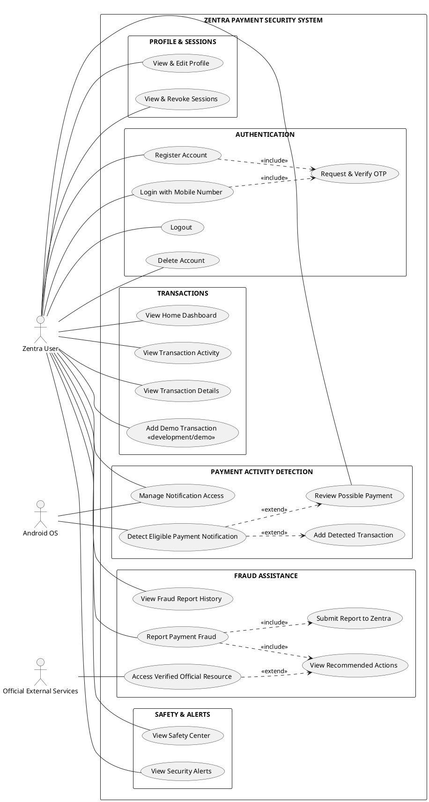
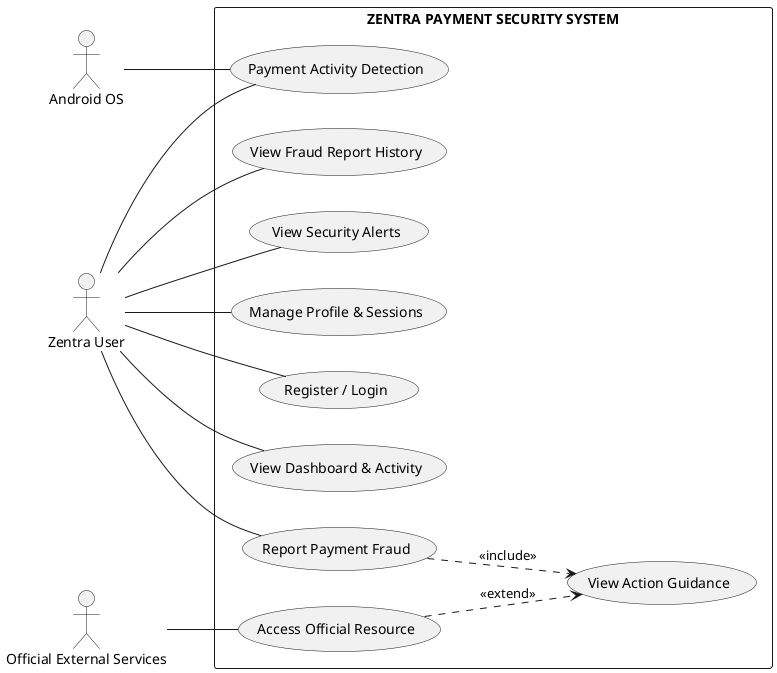

# Zentra — Academic UML Use Case Specification & Diagram Suite

This document provides the authoritative academic UML Use Case Diagrams, Use Case Specifications, Actor Descriptions, and Implementation Traceability for the Zentra payment security system.

---

## 1. Actor Identification Summary

| Actor Name | Type | Role & System Interaction Description |
|---|---|---|
| **Zentra User** | Primary Human Actor | Registered Android application user who authenticates via mobile OTP, views financial summaries, manages sessions, enables payment detection, and reports fraud incidents. |
| **Android OS** | System Actor | Provides Android `NotificationListenerService` bindings, permission toggles, system notifications, and hardware Android KeyStore cryptography services. |
| **Official External Services** | External Actor | Represents external government helplines (`1930`), reporting portals (`cybercrime.gov.in`), and complaint systems (`RBI CMS`, `Chakshu`). *Note: Zentra provides direct verified links; users manually initiate calls/visits.* |

---

## 2. High-Resolution Visual Diagram Assets

- **Full Technical Use Case SVG**: [`docs/uml/zentra_use_case_full.svg`](file:///c:/Users/kanha/Downloads/Zentra/docs/uml/zentra_use_case_full.svg)
- **Full Technical Use Case PNG**: [`docs/uml/zentra_use_case_full.png`](file:///c:/Users/kanha/Downloads/Zentra/docs/uml/zentra_use_case_full.png)
- **Presentation Use Case SVG**: [`docs/uml/zentra_use_case_presentation.svg`](file:///c:/Users/kanha/Downloads/Zentra/docs/uml/zentra_use_case_presentation.svg)
- **Presentation Use Case PNG**: [`docs/uml/zentra_use_case_presentation.png`](file:///c:/Users/kanha/Downloads/Zentra/docs/uml/zentra_use_case_presentation.png)

---

## 3. Version A — Full Technical Use Case Diagram (PlantUML Source)

---

## 4. Version B — Presentation Use Case Diagram (PPT / Viva Simplified)

---

## 5. Use Case Specification Table

| Use Case ID | Use Case Name | Primary Actor | Preconditions | Main Outcome / Postcondition |
|---|---|---|---|---|
| **UC-01** | Register Account | Zentra User | App installed, valid Indian mobile number | New user account created, JWT session tokens issued. |
| **UC-02** | Login with Mobile | Zentra User | Registered account exists | 6-digit OTP validated, JWT access token & 30-day refresh token stored in Keystore. |
| **UC-03** | View Transactions | Zentra User | Authenticated session | Paginated transaction activity list loaded with exact 2-decimal amounts. |
| **UC-04** | Enable Payment Detection | Zentra User | NotificationListener permission granted | On-device Regex parser listens for bank payment alerts; parses candidates locally. |
| **UC-05** | Report Payment Fraud | Zentra User | Authenticated session | Fraud incident saved in Zentra database; deterministic guidance displayed. |
| **UC-06** | Access Official Resource | Zentra User | Incident guidance viewed | Direct dialing (`1930`) or web portal navigation (`cybercrime.gov.in`) initiated safely. |
| **UC-07** | View Fraud History | Zentra User | Authenticated session | Historical Zentra fraud submissions & timelines loaded. |
| **UC-08** | Manage Sessions | Zentra User | Authenticated session | Active hardware devices listed; revoked sessions terminated immediately. |
| **UC-09** | Edit Profile | Zentra User | Authenticated session | User full name and email updated in database. Mobile number remains immutable. |

---

## 6. Implementation Traceability Matrix

| Use Case Name | Mobile UI Screen (`apps/mobile/src/screens/`) | Backend Service (`apps/api/src/modules/`) |
|---|---|---|
| Register Account | `LoginScreen.tsx`, `OtpScreen.tsx`, `RegistrationScreen.tsx` | `AuthModule` (`auth.service.ts`) |
| Login with Mobile | `LoginScreen.tsx`, `OtpScreen.tsx` | `AuthModule` (`auth.service.ts`) |
| View Transactions | `HomeScreen.tsx`, `ActivityScreen.tsx`, `TransactionDetailScreen.tsx` | `TransactionsModule` (`transactions.service.ts`) |
| Payment Detection | `SafetyScreen.tsx`, `NotificationBridgeService.ts` | `TransactionsModule` (`transactions.service.ts`) |
| Report Fraud | `IncidentLandingScreen.tsx`, `IncidentDetailsScreen.tsx`, `IncidentGuidanceScreen.tsx` | `FraudModule` (`fraud.service.ts`) |
| View Fraud History | `ProfileScreen.tsx`, `FraudReportHistoryScreen.tsx`, `FraudReportDetailScreen.tsx` | `FraudModule` (`fraud.service.ts`) |
| Manage Sessions | `SessionsScreen.tsx` | `SessionsModule` (`sessions.service.ts`) |
| Edit Profile | `EditProfileScreen.tsx` | `UsersModule` (`users.service.ts`) |
